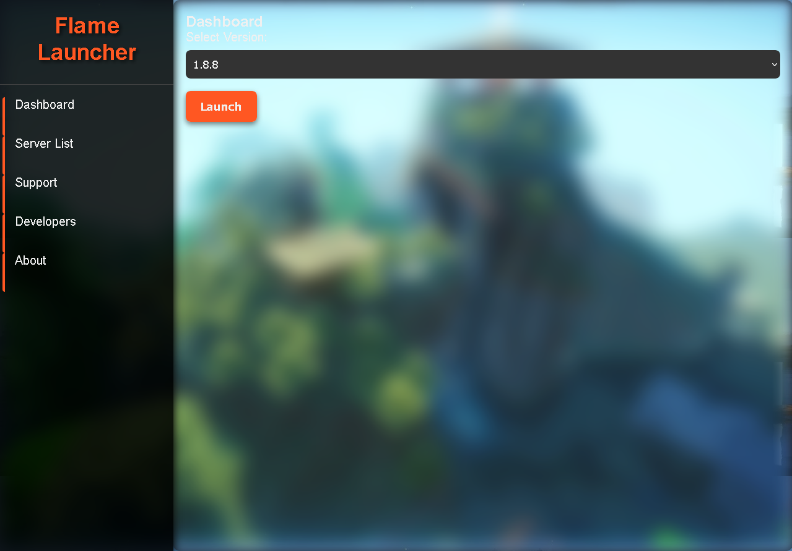

# Flame Launcher

**Flame Launcher** is a custom Eaglercraft launcher designed to offer a premium experience with a modern user interface and advanced features. This launcher is compatible with various versions of Eaglercraft and aims to provide an intuitive and seamless experience for users.

 

## Features

- **Version Selection**: Choose from multiple Eaglercraft versions and launch them with a single click.
- **Client Management**: Access and launch different Eaglercraft clients directly from the launcher.
- **Server List**: View and connect to a list of popular Eaglercraft servers.
- **Customizable UI**: Enjoy a modern, visually appealing user interface with smooth transitions and effects.
- **Dynamic Background**: Experience a dynamic background that changes based on time of day or other conditions, adding a unique touch to the user interface.
- **Developer Info**: Get insights about the developers behind Flame Launcher.

## Installation

To get started with Flame Launcher, follow these steps:

1. **Clone the Repository**:
    ```bash
    git clone https://github.com/yourusername/flame-launcher.git
    ```

2. **Navigate to the Project Directory**:
    ```bash
    cd flame-launcher
    ```

3. **Open `index.html` in Your Browser**:
    Simply open `index.html` with a modern web browser to use the launcher.

## Usage

1. **Select Eaglercraft Version**: Use the dropdown menu to choose the desired version of Eaglercraft.
2. **Launch Eaglercraft**: Click the "Launch" button to start the selected version.
3. **Manage Clients**: Use the client selector to choose and launch different Eaglercraft clients.
4. **View Server List**: Access the server list to connect to your favorite Eaglercraft servers.

## Contributing

We welcome contributions to improve Flame Launcher! If you'd like to contribute, please follow these steps:

1. **Fork the Repository**: Click the "Fork" button on the top right corner of this page.
2. **Create a New Branch**:
    ```bash
    git checkout -b feature/your-feature
    ```
3. **Make Your Changes**: Implement your changes and test them.
4. **Submit a Pull Request**: Push your changes and open a pull request with a description of your modifications.

## License

Flame Launcher is licensed under the [MIT License](LICENSE).

## Contact

For any questions or support, feel free to reach out:

- **Email**: Flameclient1.0@gmail.com

## Acknowledgements

- **FLQMZECLIENT**: Lead Developer
- **AR-dev**: Co-Developer

Thank you for using Flame Launcher!
